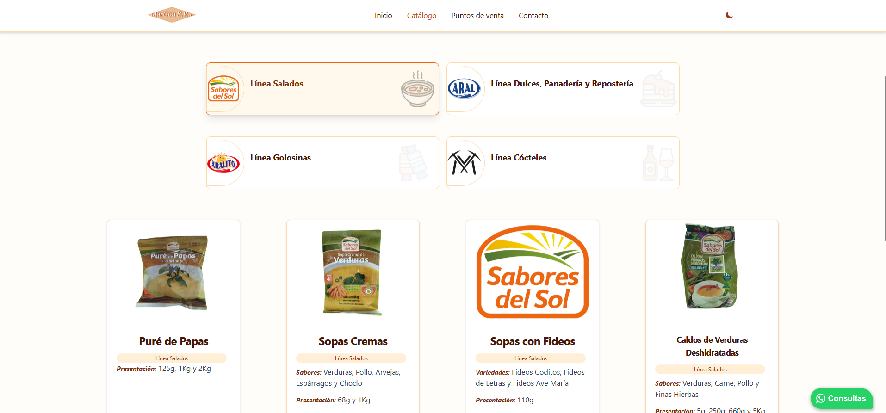

# Stack

 Astro

 Vue

 JS

 Tailwind

- 3 ramas de catálogos distintos (a pedido del cliente)
- Modo Dark - Light
- Todo el css hecho con tailwind y Flowbite
- Envío de formulario con vue, axios y vue-sonner para toast

